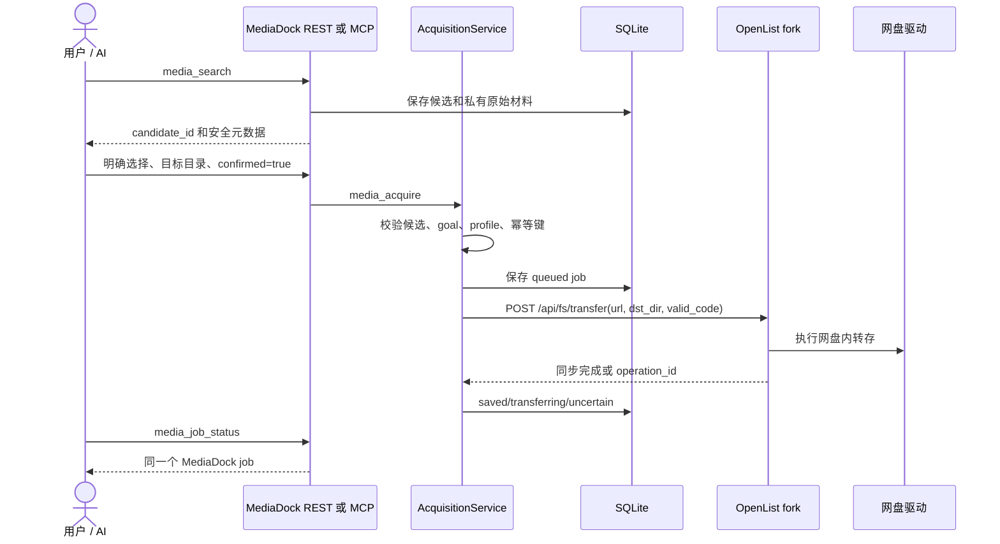
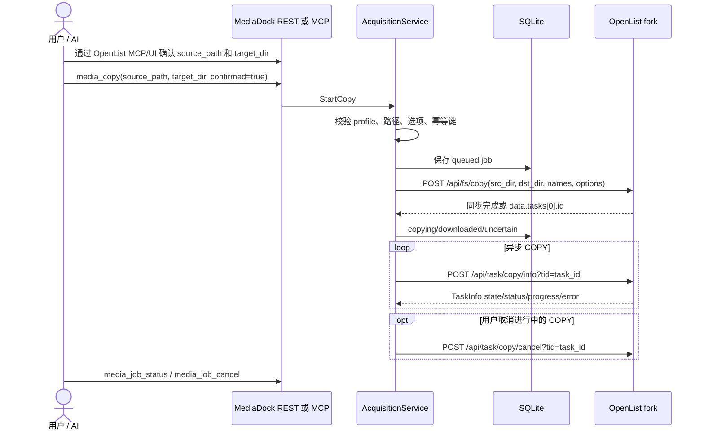

# MediaDock 架构与 OpenList fork 集成

## 1. 设计结论

MediaDock 是媒体业务编排层，不是 OpenList 的第二个客户端，也不是文件传输引擎。

```text
AI / WebUI / REST 客户端
        │
        ├── MediaDock MCP：media_search / media_acquire / media_copy / jobs
        └── MediaDock REST：同一套业务服务的 HTTP 入口
                         │
                         ▼
                 AcquisitionService
              确认 · 选择 · 幂等 · Worker
              状态 · 恢复 · SQLite 持久化
                         │
              ┌──────────┴──────────┐
              ▼                     ▼
       BT 下载器适配器        OpenList HTTP adapter
       Transmission/qBittorrent  transfer / COPY
                                      │
                                      ▼
                                OpenList fork
                              权限 · 驱动 · 数据流
```

关键边界：

- AI 只看到媒体业务工具和稳定的 job ID，不负责跨会话衔接远端任务。
- REST 和 MCP 都直接进入同一个 `SearchService`、`AcquisitionService`，不发生“MediaDock MCP 再调用 MediaDock REST”的 HTTP 套娃。
- MediaDock 调 OpenList HTTP API，不调 OpenList MCP。
- OpenList fork 只需要适配分享转存和文件 COPY 两个窄操作；OpenList 自己继续负责登录、Cookie、网盘驱动、ACL 和实际文件数据流。
- OpenList 自有 MCP 仍可被 AI 客户端独立连接，用于列目录、查看文件和获取链接；它不是 MediaDock 主流程的旁路任务入口。

## 2. 两条获取链路

### 2.1 搜索候选 → 分享转存



`candidate_id` 是服务端句柄。原始分享 URL 和提取码保存在 MediaDock 内部，只有在确认后的适配器调用中发送给 OpenList；普通搜索响应和 MCP 输出不暴露它们。

### 2.2 已知 OpenList 文件 → COPY



COPY 不依赖搜索候选，不重新调用分享转存，也不把 OpenList link 解析成 MediaDock 本地下载。MediaDock 只追踪由它创建的 COPY job。

## 3. 对外接口

| 业务               | REST                                        | MCP                                   | 外部操作                                |
| ------------------ | ------------------------------------------- | ------------------------------------- | --------------------------------------- |
| 搜索               | `POST /api/v1/search`                       | `media_search`                        | 搜索 provider                           |
| 候选获取           | `POST /api/v1/acquisitions`                 | `media_acquire`                       | 分享转存或配置的下载器                  |
| OpenList 文件 COPY | `POST /api/v1/copies`                       | `media_copy`                          | `/api/fs/copy`                          |
| 查询任务           | `GET /api/v1/jobs/{id}`、`GET /api/v1/jobs` | `media_job_status`、`media_jobs_list` | 不改变外部任务                          |
| 核对不确定任务     | `POST /api/v1/jobs/{id}/reconcile`          | `media_job_reconcile`                 | 只查询 transfer/COPY status             |
| 取消任务           | `POST /api/v1/jobs/{id}/cancel`             | `media_job_cancel`                    | 只取消 MediaDock 管理且适配器支持的任务 |
| 能力发现           | `GET /api/v1/capabilities`                  | `media_capabilities`                  | 返回 profile 和 operation               |

### `media_acquire`

```json
{
  "candidate_id": "candidate_xxx",
  "goal": "save_to_cloud",
  "target_profile": "openlist_default",
  "target_dir": "/夸克网盘/MediaDock",
  "confirmed": true,
  "idempotency_key": "request_xxx"
}
```

`save_to_cloud` 的 `target_dir` 会作为 OpenList transfer 的 `dst_dir`。没有传入时，旧部署可以使用 `OPENLIST_DEST_DIR` fallback；新调用方应显式传入。`download_to_local` 仍用于 Transmission/qBittorrent 等已配置下载执行端。

### `media_copy`

```json
{
  "target_profile": "openlist_default",
  "source_path": "/夸克网盘/Incoming/movie.mkv",
  "target_dir": "/夸克网盘/MediaDock",
  "overwrite": false,
  "skip_existing": true,
  "merge": false,
  "confirmed": true,
  "idempotency_key": "copy_xxx"
}
```

`source_path` 和 `target_dir` 是 OpenList 虚拟路径，不是 MediaDock 容器路径。`target_profile` 选择服务端配置的 OpenList 实例和凭据。调用方仍必须先让用户确认具体源文件、目标目录和覆盖策略；`confirmed` 不能单独被视为可信 UI 审批凭证。

## 4. OpenList adapter 和 fork 合同

`internal/acquisition/openlist.go` 实现 `Downloader`、`GoalAwareDownloader`、`CopyDownloader` 和 operation-aware 状态接口。它只做以下工作：

1. 校验候选类型、OpenList 路径和 profile；
2. 把分享候选映射为 `/api/fs/transfer`；
3. 把一个已知文件拆成 `src_dir`、`names`，映射为 `/api/fs/copy`；
4. 按 operation 查询 `/api/fs/transfer/status`，或按 OpenList task ID 查询 `/api/task/copy/info`；
5. 对 COPY 调用 OpenList 原生 `/api/task/copy/cancel`；
6. 保存安全的目标目录和文件引用。

它不调用 `/api/fs/list` 预检，也不代理 OpenList 的通用 `list/get/link` API。实际接口、响应、状态词和错误/不确定语义见 [`openlist-mediadock-protocol.md`](openlist-mediadock-protocol.md)。

OpenList fork 的最低新增/适配集合：

```text
POST /api/fs/transfer              # Fork 提供的分享转存入口
POST /api/fs/transfer/status       # 仅当 transfer 异步且没有可复用任务查询时
```

COPY 直接使用 OpenList 现有的：

```text
POST /api/fs/copy
POST /api/task/copy/info?tid=<task_id>
POST /api/task/copy/cancel?tid=<task_id>
```

因此 Fork 不需要新增 `/api/fs/copy/status` 或 `/api/fs/copy/cancel`。同步 COPY 可以返回 `data=null` 或 OpenList 的 `Copy operations completed immediately`；异步 COPY 返回 `data.tasks[0].id`，MediaDock 保存这个原生 task ID。转存请求会带 `Idempotency-Key` 和 `X-MediaDock-Job-ID`，Fork 可以用它们做远端幂等关联和审计。

## 5. 任务状态、幂等和恢复

```text
分享转存：queued → acquiring → downloading / transferring
                         ├── transferred / saved
                         └── transfer_uncertain / uncertain

OpenList COPY：queued → acquiring → downloading / copying
                         ├── downloaded
                         └── submission_uncertain / uncertain

普通 BT：queued → acquiring → downloading → downloaded
```

兼容 status 和内部 phase 分开表达：

- `status=downloading, phase=transferring` 表示分享转存进行中；
- `status=downloading, phase=copying` 表示 OpenList COPY 进行中；
- `status=transferred, phase=saved` 表示网盘内转存完成；
- `status=downloaded, phase=downloaded` 对 COPY 表示已复制到 OpenList 目标，不表示经过 MediaDock 的本地文件流。

MediaDock 持久化候选快照、job、目标目录、source path、COPY 选项、operation、远端 ID、目标引用、请求摘要、状态和恢复动作。Worker 重启后：

- `queued` 可以安全提交一次；
- 已进入外部提交而尚未持久化结果的 `acquiring` 不重发，标为不确定；
- 已取得远端 operation ID 的任务只查询对应 status；
- status 查询失败不会再次提交 transfer/COPY；
- 不确定任务需要 `media_job_reconcile` 或人工检查，不能仅换幂等键重试。

幂等键绑定完整业务意图。相同 key 和相同候选/源文件、profile、目标、选项会返回同一个 job；相同 key 的不同意图返回冲突。直接在 OpenList MCP 创建的独立任务不自动导入 MediaDock，也不自动出现在 MediaDock job 列表中。

## 6. 组件职责

| 组件                     | 负责                                                        | 不负责                                       |
| ------------------------ | ----------------------------------------------------------- | -------------------------------------------- |
| MediaDock                | 候选句柄、确认门、业务工具、幂等、Worker、状态/恢复、SQLite | 网盘登录、Cookie、通用文件浏览、文件传输引擎 |
| OpenList fork            | transfer/COPY HTTP、ACL、网盘驱动、远端任务和数据流         | 媒体搜索、候选选择、MediaDock job 生命周期   |
| Transmission/qBittorrent | BT 任务、下载进度和下载端能力                               | MediaDock 候选与确认                         |
| AI 客户端                | 理解请求、展示候选/路径、取得确认、提交和查询               | 依赖聊天会话持续在线调度任务                 |
| OpenList MCP             | 独立网盘浏览/文件查询/链接访问                              | MediaDock 主流程的任务记录                   |

## 7. 配置和部署

OpenList 凭据只保存在 MediaDock 服务端配置，并与 MediaDock 对外 Bearer Token 分开：

| 配置                      | 含义                                              |
| ------------------------- | ------------------------------------------------- |
| `DOWNLOADERS`             | 加入 `openlist` 后启用 OpenList adapter           |
| `OPENLIST_BASE_URL`       | OpenList fork 根地址                              |
| `OPENLIST_AUTH_TOKEN`     | 发给 OpenList `Authorization` 的原值              |
| `OPENLIST_TARGET_PROFILE` | 对外 profile ID，不是路径                         |
| `OPENLIST_DEST_DIR`       | deprecated fallback；请求 `target_dir` 优先       |
| `DOWNLOAD_INCOMING_DIR`   | BT 本地执行端的可选目录，与 OpenList 虚拟路径无关 |

MediaDock 不需要挂载 OpenList 网盘数据卷。OpenList 自己管理账号、Cookie 和挂载。OpenList 目标目录是否存在、是否可写、源文件是否可读，最终由 OpenList API 判断。

完整字段约束见协议文档；部署联调记录见 [`deploy/INTEGRATION.md`](../deploy/INTEGRATION.md)。
